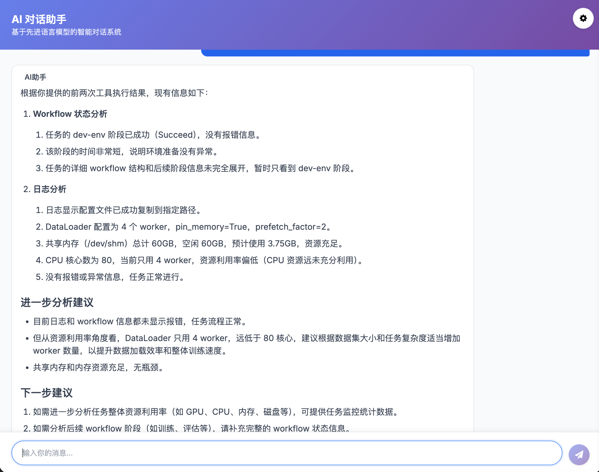

# CORTEX

<p align="center">CORTEX 是一个为高效集成和利用大型语言模型 (LLM) 而设计的 AI Agent 框架，使用 Go 语言构建。</p>

<p align="center">
  
  
</p>

<p align="center">
  <a href="#概述">概述</a>
  · <a href="#特性与状态">特性</a>
  · <a href="#安装">安装</a>
  · <a href="#基本用法">用法</a>
  · <a href="#agent-模块使用">Agent 模块</a>
  · <a href="#示例">示例</a>
  · <a href="#许可证">许可证</a>
</p>

<p align="center">
  <a href="README.md">English</a> | 简体中文
</p>

## 概述

CORTEX 是一个为高效集成和利用大型语言模型 (LLM) 而设计的 AI Agent 框架。它使用 Go 语言构建，Go 是企业应用中最受欢迎的编程语言之一。CORTEX 结合了轻量级框架的简单性和 Go 语言的稳健性与性能，提供了与各种 LLM 的无缝集成，并提供了一套全面的工具，用于构建具有工具调用能力的 AI 代理。

与其他代理框架不同，CORTEX 专为生产环境部署而设计，具有强大的错误处理、灵活的配置和高效的资源利用。以 Go 语言为基础，CORTEX 为下一代 AI 应用提供卓越的性能和安全的代理能力。

CORTEX 实现的功能类似于 n8n 的 AI Agent，但采用了轻量级设计理念。在实际开发中，许多场景并不需要 n8n 提供的复杂流程编排能力，且将 n8n 完整集成到自有项目中存在一定的配置复杂度和资源占用问题。相比之下，本库专为简化集成流程而设计，保持了核心的 AI Agent 功能同时大幅降低了使用门槛，非常适合对资源占用和集成复杂度有严格要求的项目场景。

## 特性与状态

- **智能代理引擎**：用于创建具有高级工具调用能力的 AI 代理的核心功能。
- **LLM 集成**：无缝支持 OpenAI、DeepSeek 和自定义 LLM 提供商。
- **多模态支持**：轻松处理文本、图像和其他媒体格式。
- **工具生态系统**：可扩展的工具系统，内置 MCP 和 HTTP 客户端。
- **流式传输支持**：为交互式应用程序提供实时响应流式传输。
- **内存管理**：用于保存对话历史的上下文感知内存系统。
- **配置灵活性**：全面的选项，用于微调代理行为。
- **并行工具调用**：高效地同时执行多个工具。
- **健壮的错误处理**：全面的错误管理和重试机制。

## 架构概述

Cortex 采用模块化架构，包含以下关键组件：

> 注意：agent 包基于 [LangChain](https://github.com/tmc/langchaingo) 实现，利用其强大的 LLM 交互和工具调用能力构建智能代理系统。

```
cortex/
├── agent/             # 核心代理功能
│   ├── engine/        # 代理引擎实现
│   ├── llm/           # LLM 提供商集成
│   ├── tools/         # 工具生态系统（MCP、HTTP）
│   ├── types/         # 核心类型定义
│   ├── providers/     # 外部服务提供商
│   ├── errors/        # 错误处理
│   └── logger/        # 结构化日志记录
└── examples/          # 示例应用程序
    ├── basic/         # 基本用法示例
    └── chat-web/      # 基于Web的聊天应用
        └── server/    # Web服务器实现
```

## 快速开始

### 安装

```bash
go get github.com/xichan96/cortex
```

### 基本用法

以下是如何使用 Cortex 创建 AI 代理的简单示例：

```go
package main

import (
	"context"
	"fmt"
	"time"

	"github.com/xichan96/cortex/agent/engine"
	"github.com/xichan96/cortex/agent/llm"
	"github.com/xichan96/cortex/agent/types"
)

func main() {
	// 1. 创建 LLM 提供商
	llmProvider, err := llm.OpenAIClient("your-api-key", "gpt-4o-mini")
	if err != nil {
		fmt.Printf("创建 LLM 提供商时出错: %v\n", err)
		return
	}

	// 2. 创建代理配置
	agentConfig := types.NewAgentConfig()
	// 基本配置
	agentConfig.MaxIterations = 5                  // 最大迭代次数
	agentConfig.ReturnIntermediateSteps = true    // 返回中间步骤
	agentConfig.SystemMessage = "你是一个有帮助的 AI 助手。"

	// 高级配置
	agentConfig.Temperature = 0.7                  // 创造力水平
	agentConfig.MaxTokens = 2048                   // 响应长度限制
	agentConfig.TopP = 0.9                         // Top P 采样
	agentConfig.FrequencyPenalty = 0.1             // 频率惩罚
	agentConfig.PresencePenalty = 0.1              // 存在惩罚
	agentConfig.Timeout = 30 * time.Second         // 请求超时
	agentConfig.RetryAttempts = 3                  // 重试次数
	agentConfig.EnableToolRetry = true             // 启用工具重试
	agentConfig.ToolRetryAttempts = 2              // 工具重试次数
	agentConfig.ParallelToolCalls = true           // 并行工具调用
	agentConfig.ToolCallTimeout = 10 * time.Second // 工具调用超时

	// 3. 创建代理引擎
	agentEngine := engine.NewAgentEngine(llmProvider, agentConfig)

	// 4. 添加工具（可选）
	// agentEngine.AddTool(yourTool)

	// 5. 执行代理
	result, err := agentEngine.Execute("今天纽约的天气怎么样？", nil)
	if err != nil {
		fmt.Printf("执行代理时出错: %v\n", err)
		return
	}

	fmt.Printf("代理结果: %s\n", result.Output)
}
```

## Agent 模块使用

Agent 模块是 Cortex 框架的核心，提供智能和工具集成功能。

### LLM 提供商集成

Cortex 支持 OpenAI、DeepSeek 和自定义 LLM 提供商，具有灵活的配置选项：

```go
// OpenAI 默认配置
llmProvider, err := llm.OpenAIClient("your-api-key", "gpt-4o-mini")

// OpenAI 自定义基础 URL
llmProvider, err := llm.OpenAIClientWithBaseURL("your-api-key", "https://custom-api.example.com", "custom-model")

// DeepSeek 集成
llmProvider, err := llm.DeepSeekClient("your-api-key", "deepseek-chat")

// 使用 OpenAI 的高级选项
opts := llm.OpenAIOptions{
	APIKey:  "your-api-key",
	BaseURL: "https://api.openai.com",
	Model:   "gpt-4o",
	OrgID:   "your-organization-id",
}
llmProvider, err := llm.NewOpenAIClient(opts)

// 使用 DeepSeek 的高级选项
opts := llm.DeepSeekOptions{
	APIKey:  "your-api-key",
	BaseURL: "https://api.deepseek.com",
	Model:   "deepseek-chat",
}
llmProvider, err := llm.NewDeepSeekClient(opts)
```

### Agent 配置

使用 `AgentConfig` 结构体对代理进行广泛配置：

```go
agentConfig := types.NewAgentConfig()

// 基本配置
agentConfig.MaxIterations = 5                  // 最大迭代次数
agentConfig.ReturnIntermediateSteps = true    // 返回中间步骤
agentConfig.SystemMessage = "你是一个有帮助的 AI 助手。"

// 高级配置
agentConfig.Temperature = 0.7                  // 创造力水平
agentConfig.MaxTokens = 2048                   // 响应长度限制
agentConfig.TopP = 0.9                         // Top P 采样
agentConfig.FrequencyPenalty = 0.1             // 频率惩罚
agentConfig.PresencePenalty = 0.1              // 存在惩罚
agentConfig.Timeout = 30 * time.Second         // 请求超时
agentConfig.RetryAttempts = 3                  // 重试次数
agentConfig.EnableToolRetry = true             // 启用工具重试
agentConfig.ToolRetryAttempts = 2              // 工具重试次数
agentConfig.ParallelToolCalls = true           // 并行工具调用
agentConfig.ToolCallTimeout = 10 * time.Second // 工具调用超时
```

### Agent 引擎创建

```go
// 使用 LLM 提供商和配置创建代理引擎
agentEngine := engine.NewAgentEngine(llmProvider, agentConfig)
```

### 工具管理

通过添加工具扩展代理的能力：

```go
// 添加单个工具
agentEngine.AddTool(tool)

// 添加多个工具
agentEngine.AddTools([]types.Tool{tool1, tool2, tool3})
```

### Agent 执行

使用各种输入类型和模式执行代理：

```go
// 使用文本输入执行
result, err := agentEngine.Execute("法国的首都是什么？", nil)
if err != nil {
	// 处理错误
}
fmt.Printf("代理输出: %s\n", result.Output)

// 使用流式传输执行
stream, err := agentEngine.ExecuteStream("给我讲一个关于 AI 的故事。", nil)
if err != nil {
	// 处理错误
}

for chunk := range stream {
	if chunk.Error != nil {
		// 处理流式传输错误
		break
	}
	fmt.Printf("%s", chunk.Content)
}

// 使用多模态输入执行（例如，文本 + 图像）
messages := []types.Message{
	{
		Role: types.RoleUser,
		Content: []types.ContentPart{
			{
				Type: "text",
				Text: "这张图片里有什么？",
			},
			{
				Type: "image_url",
				ImageURL: map[string]interface{}{
					"url": "https://example.com/image.jpg",
				},
			},
		},
	},
}
result, err := agentEngine.ExecuteWithMessages(messages, nil)
```

### 内置工具集成

#### MCP 工具集成

利用对 MCP（模型控制协议）工具的内置支持：

```go
import "github.com/xichan96/cortex/agent/tools/mcp"

// 创建 MCP 客户端
mcpClient := mcp.NewClient("https://api.example.com/mcp/sse", "http", map[string]string{
	"Content-Type": "application/json",
})

// 连接到 MCP 服务器
ctx := context.Background()
if err := mcpClient.Connect(ctx); err != nil {
	// 处理连接错误
}

// 获取 MCP 工具并添加到代理
mcpTools := mcpClient.GetTools()
agentEngine.AddTools(mcpTools)

// 完成后不要忘记断开连接
defer mcpClient.Disconnect(ctx)
```

#### HTTP 客户端工具

使用集成的 HTTP 客户端工具发出 API 请求：

```go
import "github.com/xichan96/cortex/agent/tools/http"

// 创建 HTTP 客户端
httpClient := http.NewClient()

// 将 HTTP 工具添加到代理
httpTools := httpClient.GetTools()
agentEngine.AddTools(httpTools)
```


## 示例

### 基本示例

`examples/basic` 目录包含一个简单示例，演示如何使用 Cortex 创建通过 MCP 连接到 AI 训练服务的 AI 代理。

```go
// 请参阅 examples/basic/main.go 获取完整示例
```

### 聊天 Web 示例

`examples/chat-web` 目录包含使用 Cortex 的基于 Web 的聊天应用程序。

```go
// 请参阅 examples/chat-web/main.go 获取完整示例
```

## 高级用法

### 自定义工具

您可以通过实现 `types.Tool` 接口来创建自定义工具：

```go
type CustomTool struct {}

func (t *CustomTool) Name() string {
	return "custom_tool"
}

func (t *CustomTool) Description() string {
	return "执行特定功能的自定义工具"
}

func (t *CustomTool) Schema() map[string]interface{} {
	return map[string]interface{}{
		"type": "object",
		"properties": map[string]interface{}{
			"input": map[string]interface{}{
				"type":        "string",
				"description": "自定义工具的输入",
			},
		},
		"required": []string{"input"},
	}
}

func (t *CustomTool) Execute(input map[string]interface{}) (interface{}, error) {
	// 工具执行逻辑
	return "工具结果", nil
}

func (t *CustomTool) Metadata() types.ToolMetadata {
	return types.ToolMetadata{
		SourceNodeName: "custom_tool",
		IsFromToolkit:  false,
		ToolType:       "custom",
	}
}
```

### 内存管理

Cortex 提供用于对话历史的内存管理功能：

```go
// 设置内存提供商
memoryProvider := providers.NewLangChainMemory()
agentEngine.SetMemory(memoryProvider)

// 配置内存使用
agentConfig.MaxTokensFromMemory = 1000 // 内存中的最大令牌数
```

### 错误处理

Cortex 包含全面的错误处理：

```go
import "github.com/xichan96/cortex/agent/errors"

// 检查特定错误类型
if errors.Is(err, errors.ErrToolExecution) {
	// 处理工具执行错误
} else if errors.Is(err, errors.ErrLLMCall) {
	// 处理 LLM 调用错误
}
```

## 配置参考

### 代理配置选项

| 选项 | 描述 | 默认值 |
|--------|-------------|---------|
| `MaxIterations` | 最大迭代次数 | 5 |
| `ReturnIntermediateSteps` | 返回中间步骤 | false |
| `SystemMessage` | 系统提示消息 | "" |
| `Temperature` | LLM 温度（创造力） | 0.7 |
| `MaxTokens` | 每个响应的最大令牌数 | 2048 |
| `TopP` | Top P 采样参数 | 0.9 |
| `FrequencyPenalty` | 频率惩罚 | 0.1 |
| `PresencePenalty` | 存在惩罚 | 0.1 |
| `Timeout` | 请求超时 | 30s |
| `RetryAttempts` | 重试次数 | 3 |
| `EnableToolRetry` | 启用工具重试 | false |
| `ToolRetryAttempts` | 工具重试次数 | 2 |
| `ParallelToolCalls` | 启用并行工具调用 | false |
| `ToolCallTimeout` | 工具调用超时 | 10s |
| `MaxTokensFromMemory` | 内存中的最大令牌数 | 1000 |
| `EnableCache` | 启用响应缓存 | true |
| `CacheSize` | 缓存项的最大数量 | 1000 |

## 贡献

欢迎贡献！请随时提交 Pull Request。

## 许可证

本项目采用 MIT 许可证 - 有关详细信息，请参阅 LICENSE 文件。

## 支持

如有问题、疑问或功能请求，请在 GitHub 存储库中创建问题。