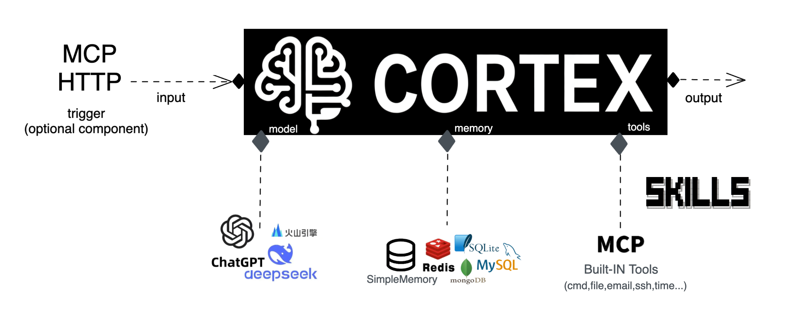

# CORTEX

<p align="center">CORTEX 是一个基于 Go 语言构建的高性能 AI Agent 框架，专为高效集成大型语言模型 (LLM) 而设计。</p>

<p align="center">
  
  
</p>

<p align="center">
  <a href="#概述">概述</a>
  · <a href="#特性">特性</a>
  · <a href="#快速开始">快速开始</a>
  · <a href="#核心组件">核心组件</a>
  · <a href="#工具生态">工具生态</a>
  · <a href="#技能系统-agent-skills">技能系统</a>
  · <a href="#记忆系统">记忆系统</a>
  · <a href="#示例">示例</a>
  · <a href="#许可证">许可证</a>
</p>

<p align="center">
  <a href="README.md">English</a> | 简体中文
</p>

## 概述

CORTEX 旨在融合轻量级框架的易用性与 Go 语言的稳健性能。它不仅提供了与各类主流 LLM 的深度集成，还内置了一套完整的工具链，助力开发者快速构建具备复杂工具调用能力的 AI Agent。

与传统框架相比，CORTEX 更专注于生产环境的落地，具备工业级的错误处理机制、灵活的配置系统以及极致的资源利用率。得益于 Go 语言的并发优势，CORTEX 能够为下一代 AI 应用提供卓越的性能表现和安全保障。

设计理念上，CORTEX 侧重于轻量化和易集成性。针对无需复杂流程编排的场景，CORTEX 摒弃了繁重的依赖和配置负担，在保留核心 Agent 能力的同时，大幅降低了集成门槛和资源占用，是构建高效、嵌入式 AI 应用的理想选择。

## 特性

- **智能代理引擎**：核心引擎支持复杂的工具调用与逻辑推理，轻松构建智能 Agent。
- **广泛的 LLM 支持**：深度集成 OpenAI、DeepSeek、火山引擎 (Volce) 等主流模型，并支持自定义 Provider。
- **多模态交互**：原生支持文本、图像等多模态数据的处理与交互。
- **动态技能 (Skills)**：支持基于文件系统的技能动态加载与管理，通过 Lazy Load 模式优化资源占用。
- **开放工具生态**：内置 MCP 和 HTTP 客户端，轻松扩展外部工具与服务。
- **实时流式响应**：全链路支持流式 (Streaming) 传输，为交互式应用提供丝滑的用户体验。
- **混合记忆架构**：采用“全量记录+滚动摘要”的混合存储策略，在大幅降低 Token 消耗的同时完整保留对话上下文。内置异步压缩机制，确保高并发场景下的极低延迟体验。全面支持 LangChain、MongoDB、Redis、MySQL 及 SQLite。
- **灵活配置**：提供细粒度的配置选项，满足对 Agent 行为的精准控制需求。
- **高并发工具调用**：支持并行执行多个工具调用，显著提升任务处理效率。
- **企业级错误处理**：内置完善的错误重试与降级机制，确保系统稳健运行。

## 架构概述

Cortex 采用模块化架构设计，核心组件如下：

> **注**：`agent` 包底层复用了 [LangChain](https://github.com/tmc/langchaingo) 的核心能力，通过其强大的 LLM 交互接口与工具调用机制，构建出灵活且强大的智能代理系统。

```
cortex/
├── agent/             # 核心代理功能
│   ├── engine/        # 代理引擎实现
│   ├── llm/           # LLM 提供商集成
│   ├── skills/        # 技能加载与管理
│   ├── tools/         # 工具生态系统（MCP、HTTP）
│   ├── types/         # 核心类型定义
│   ├── providers/     # 外部服务提供商
│   ├── errors/        # 错误处理
│   └── logger/        # 结构化日志记录
├── trigger/           # 触发器模块
│   ├── http/          # HTTP 触发器（REST API）
│   └── mcp/           # MCP 触发器（MCP 服务器）
└── examples/          # 示例应用程序
```

## 快速开始

### 安装

```bash
go get github.com/xichan96/cortex
```

### 极简示例

以下代码展示了如何快速构建一个具备天气查询能力的 AI Agent：

```go
package main

import (
	"context"
	"fmt"
	"time"

	"github.com/xichan96/cortex/agent/engine"
	"github.com/xichan96/cortex/agent/llm"
	"github.com/xichan96/cortex/agent/types"
)

func main() {
	// 1. 初始化 LLM Provider
	llmProvider, err := llm.OpenAIClient("your-api-key", "gpt-4o-mini")
	if err != nil {
		panic(err)
	}

	// 2. 配置 Agent
	agentConfig := types.NewAgentConfig()
	agentConfig.SystemMessage = "你是一个有帮助的 AI 助手。"
	agentConfig.Timeout = 30 * time.Second

	// 3. 创建引擎实例
	agentEngine := engine.NewAgentEngine(llmProvider, agentConfig)

	// 4. 执行任务
	result, err := agentEngine.Execute(context.Background(), "今天纽约的天气怎么样？", nil)
	if err != nil {
		fmt.Printf("执行失败: %v\n", err)
		return
	}

	fmt.Printf("回复: %s\n", result.Output)
}
```

### 启动服务

Cortex 提供了开箱即用的 HTTP 服务，支持通过配置文件快速启动：

```bash
# 使用默认配置 cortex.yaml 启动
go run cortex.go

# 指定配置文件路径
go run cortex.go -config /path/to/cortex.yaml
```

服务默认监听 `:5678` 端口，提供以下核心接口：
- `POST /chat`: 标准对话接口
- `POST /chat/stream`: 流式对话接口 (SSE)
- `ANY /mcp`: MCP 协议接口

## 核心组件

### LLM 集成

Cortex 提供了统一的接口适配多种 LLM Provider，支持灵活的参数配置：

```go
// OpenAI
llmProvider, _ := llm.OpenAIClient("sk-...", "gpt-4o")

// DeepSeek
llmProvider, _ := llm.QuickDeepSeekProvider("sk-...", "deepseek-chat")

// 火山引擎 (Volcengine)
llmProvider, _ := llm.VolceClient("ak-...", "doubao-pro-32k")
```

### 触发器 (Triggers)

触发器模块允许将 Agent 暴露为不同协议的服务，便于外部系统集成。

#### HTTP 触发器
提供标准的 RESTful API，支持普通对话和流式对话。

#### MCP 触发器
完全遵循 [Model Context Protocol (MCP)](https://modelcontextprotocol.io/) 规范，允许将 Cortex Agent 作为工具被其他支持 MCP 的客户端（如 Claude Desktop）调用。

## 工具生态

Cortex 内置了丰富的工具库，开箱即用：

- **MCP 工具**：无缝连接 MCP Server，扩展无限可能。
- **文件操作**：安全的文件读写与管理。
- **SSH**：远程服务器管理与命令执行。
- **邮件**：发送 HTML/Text 邮件。
- **数学计算**：支持复杂数学表达式。
- **系统命令**：安全的本地 Shell 命令执行。

### 自定义工具

实现 `types.Tool` 接口即可轻松扩展自定义工具：

```go
type MyTool struct{}

func (t *MyTool) Name() string { return "my_tool" }
func (t *MyTool) Description() string { return "这是一个自定义工具" }
func (t *MyTool) Execute(ctx context.Context, input map[string]interface{}) (interface{}, error) {
    // 业务逻辑...
    return "执行结果", nil
}
```

## 技能系统 (Agent Skills)

Cortex 实现了一套独特的**基于文件系统的技能系统**，允许您在不重新编译代码的情况下扩展 Agent 的能力。

### 工作原理

1.  **定义**：在技能目录中创建 `SKILL.md` 文件（例如 `./skills/my-skill/SKILL.md`）。
2.  **描述**：使用 Markdown 描述任务并提供可执行的示例（如 `curl` 命令、SQL 查询等）。
3.  **发现**：Cortex 会自动扫描技能目录，并将可用技能注入到系统提示词中。
4.  **执行**：当 Agent 需要执行相关任务时，它会严格遵循 `SKILL.md` 中的指引进行操作。

### 技能示例 (`skills/weather/SKILL.md`)

````markdown
---
name: weather
description: Get current weather using command line tools.
---

# Weather

To check the weather, use `curl` with wttr.in:

```bash
curl -s "wttr.in/New+York?format=3"
```
````

这种方式使您可以轻松地将任何 CLI 工具、API 或脚本转化为 Agent 的原生能力。

## 任务调度系统

Cortex 内置了强大的任务调度系统 (`xcron`)，允许 Agent 自主管理定时任务。这使得 Agent 不仅能响应即时请求，还能处理周期性任务或延时任务。

### 核心功能

- **多种调度模式**：
  - `oneshot`: 延时执行一次（例如：“10分钟后提醒我喝水”）。
  - `periodic`: 周期性执行（例如：“每隔 2 小时检查一次服务器状态”）。
  - `cron`: 基于 Cron 表达式的精确定时（例如：“每天早上 8 点发送日报”）。
- **持久化存储**：支持任务持久化，即使服务重启，任务也不会丢失。
- **Agent 自驱动**：Agent 可以通过内置工具 (`schedule_job`, `list_jobs`, `delete_job`) 自主创建、查询和管理任务。

### 示例场景

用户：“每天早上 9 点帮我总结一下昨天的 Hacker News 热点。”

Agent 会自动调用 `schedule_job` 工具：
```json
{
  "name": "hn_daily_summary",
  "type": "cron",
  "schedule": "0 0 9 * * *",
  "payload": "总结昨天的 Hacker News 热点新闻，并发送给我。",
  "task_type": "agent_task"
}
```

## 记忆系统

Cortex 引入了先进的**混合记忆架构 (Hybrid Memory Architecture)**，旨在解决长对话场景下的 Token 消耗与上下文丢失问题。

### 架构特点

1.  **全量记录 (Raw History)**：完整保留每一条对话记录，确保信息不丢失。
2.  **滚动摘要 (Rolling Summary)**：后台异步对历史对话进行压缩摘要，生成精炼的上下文快照。
3.  **智能检索**：在构建 Prompt 时，动态组合“摘要 + 近期对话”，在有限的 Context Window 内提供最丰富的信息。
4.  **异步处理**：摘要生成过程完全异步，不阻塞主对话流程，且具备 Panic 自动恢复机制，确保系统高可用。

### 存储后端

支持多种持久化存储方案，只需简单配置即可切换：

- **Memory (默认)**: 基于 LangChain 的内存实现，适用于测试。
- **Redis**: 高性能键值存储，推荐生产环境使用。
- **MongoDB**: 灵活的文档存储。
- **MySQL / SQLite**: 传统关系型数据库支持。

```go
// 示例：使用 Redis 作为记忆存储
redisClient := redis.NewClient(&redis.Options{Addr: "localhost:6379"})
memory := providers.NewRedisMemoryProvider(redisClient, "session-id")
agentEngine.SetMemory(context.Background(), memory)
```

## 示例

- [Basic Example](examples/basic): 基础用法演示。
- [Chat Web](examples/chat-web): 基于 Gin + React 的完整聊天应用。
- [MCP Server](examples/mcp-server): 将 Agent 暴露为 MCP 服务。
- [Agent Skills](examples/skills): 动态加载和使用 Agent 技能。
- [Task Scheduling](examples/xcron): 使用 xcron 进行任务调度。

## 贡献

欢迎提交 Issue 和 Pull Request！

## 许可证

MIT License
