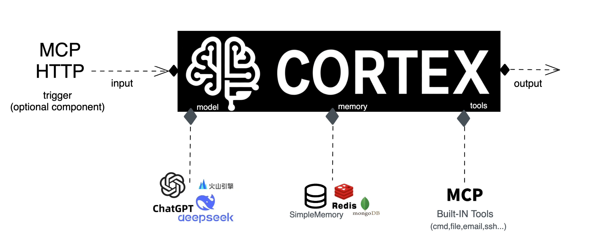

# CORTEX

<p align="center">CORTEX is an AI Agent framework designed for efficient integration and utilization of large language models (LLMs), built in Go.</p>

<p align="center">
  
  
</p>

<p align="center">
  <a href="#overview">Overview</a>
  · <a href="#features">Features</a>
  · <a href="#installation">Installation</a>
  · <a href="#basic-usage">Usage</a>
  · <a href="#agent-module-usage">Agent Module</a>
  · <a href="#examples">Examples</a>
  · <a href="#license">License</a>
</p>

<p align="center">
  English | <a href="README-CN.md">简体中文</a>
</p>

## Overview

CORTEX is an AI Agent framework designed for efficient integration and utilization of large language models (LLMs). It is built using Go, one of the most popular programming languages for enterprise applications. CORTEX combines the simplicity of a lightweight framework with the robustness and performance of Go, offering seamless integration with various LLMs and providing a comprehensive set of tools for building AI agents with tool-calling capabilities.

CORTEX implements functionality similar to n8n's AI Agent but adopts a lightweight design philosophy. In practical development, many scenarios do not require the complex workflow orchestration capabilities provided by n8n, and there are certain configuration complexities and resource usage issues when fully integrating n8n into one's own project. In contrast, this library is specifically designed to simplify the integration process, maintaining core AI Agent functionality while significantly lowering the barrier to use, making it ideal for project scenarios with strict requirements on resource usage and integration complexity.

## Feature & Status

- **Intelligent Agent Engine**: Core functionality for creating AI agents with advanced tool calling capabilities.
- **LLM Integration**: Seamless support for OpenAI, DeepSeek, and custom LLM providers.
- **Multi-Modal Support**: Process text, images, and other media formats effortlessly.
- **Tool Ecosystem**: Extensible tool system with built-in MCP and HTTP clients.
- **Streaming Support**: Real-time response streaming for interactive applications.
- **Memory Management**: Context-aware memory system for preserving conversation history with support for LangChain, MongoDB, and Redis storage backends.
- **Configuration Flexibility**: Comprehensive options for fine-tuning agent behavior.
- **Parallel Tool Calls**: Efficient execution of multiple tools simultaneously.
- **Robust Error Handling**: Comprehensive error management and retry mechanisms.

## Architecture Overview

Cortex follows a modular architecture with the following key components:

> Note: The agent package is built on top of [LangChain](https://github.com/tmc/langchaingo), leveraging its powerful LLM interaction and tool-calling capabilities to build intelligent agent systems.

```
cortex/
├── agent/             # Core agent functionality
│   ├── engine/        # Agent engine implementation
│   ├── llm/           # LLM provider integrations
│   ├── tools/         # Tool ecosystem (MCP, HTTP)
│   ├── types/         # Core type definitions
│   ├── providers/     # External service providers
│   ├── errors/        # Error handling
│   └── logger/        # Structured logging
└── examples/          # Example applications
    ├── basic/         # Basic usage example
    └── chat-web/      # Web-based chat application
        └── server/    # Web server implementation
```

## Getting Started

### Installation

```bash
go get github.com/xichan96/cortex
```

### Basic Usage

Here's a simple example of how to use Cortex to create an AI agent:

```go
package main

import (
	"context"
	"fmt"
	"time"

	"github.com/xichan96/cortex/agent/engine"
	"github.com/xichan96/cortex/agent/llm"
	"github.com/xichan96/cortex/agent/types"
)

func main() {
	// 1. Create an LLM provider
	llmProvider, err := llm.OpenAIClient("your-api-key", "gpt-4o-mini")
	if err != nil {
		fmt.Printf("Error creating LLM provider: %v\n", err)
		return
	}

	// 2. Create agent configuration
	agentConfig := types.NewAgentConfig()
	// Basic configuration
	agentConfig.MaxIterations = 5                  // Maximum number of iterations
	agentConfig.ReturnIntermediateSteps = true    // Return intermediate steps
	agentConfig.SystemMessage = "You are a helpful AI assistant."

	// Advanced configuration
	agentConfig.Temperature = 0.7                  // Creativity level
	agentConfig.MaxTokens = 2048                   // Response length limit
	agentConfig.TopP = 0.9                         // Top P sampling
	agentConfig.FrequencyPenalty = 0.1             // Frequency penalty
	agentConfig.PresencePenalty = 0.1              // Presence penalty
	agentConfig.Timeout = 30 * time.Second         // Request timeout
	agentConfig.RetryAttempts = 3                  // Retry attempts
	agentConfig.EnableToolRetry = true             // Enable tool retry
	agentConfig.ToolRetryAttempts = 2              // Tool retry attempts
	agentConfig.ParallelToolCalls = true           // Parallel tool calls
	agentConfig.ToolCallTimeout = 10 * time.Second // Tool call timeout

	// 3. Create agent engine
	agentEngine := engine.NewAgentEngine(llmProvider, agentConfig)

	// 4. Add tools (optional)
	// agentEngine.AddTool(yourTool)

	// 5. Execute the agent
	result, err := agentEngine.Execute("What is the weather in New York today?", nil)
	if err != nil {
		fmt.Printf("Error executing agent: %v\n", err)
		return
	}

	fmt.Printf("Agent result: %s\n", result.Output)
}
```

## Agent Module Usage

The agent module is the core of the Cortex framework, providing the intelligence and tool integration capabilities.

### LLM Provider Integration

Cortex supports OpenAI, DeepSeek, and custom LLM providers with flexible configuration options:

```go
// OpenAI with default configuration
llmProvider, err := llm.OpenAIClient("your-api-key", "gpt-4o-mini")

// OpenAI with custom base URL
llmProvider, err := llm.OpenAIClientWithBaseURL("your-api-key", "https://custom-api.example.com", "custom-model")

// DeepSeek integration
llmProvider, err := llm.DeepSeekClient("your-api-key", "deepseek-chat")

// With advanced options for OpenAI
opts := llm.OpenAIOptions{
	APIKey:  "your-api-key",
	BaseURL: "https://api.openai.com",
	Model:   "gpt-4o",
	OrgID:   "your-organization-id",
}
llmProvider, err := llm.NewOpenAIClient(opts)

// With advanced options for DeepSeek
opts := llm.DeepSeekOptions{
	APIKey:  "your-api-key",
	BaseURL: "https://api.deepseek.com",
	Model:   "deepseek-chat",
}
llmProvider, err := llm.NewDeepSeekClient(opts)
```

### Agent Configuration

Configure your agent with extensive options using the `AgentConfig` struct:

```go
agentConfig := types.NewAgentConfig()

// Basic configuration
agentConfig.MaxIterations = 5                  // Maximum number of iterations
agentConfig.ReturnIntermediateSteps = true    // Return intermediate steps
agentConfig.SystemMessage = "You are a helpful AI assistant."

// Advanced configuration
agentConfig.Temperature = 0.7                  // Creativity level
agentConfig.MaxTokens = 2048                   // Response length limit
agentConfig.TopP = 0.9                         // Top P sampling
agentConfig.FrequencyPenalty = 0.1             // Frequency penalty
agentConfig.PresencePenalty = 0.1              // Presence penalty
agentConfig.Timeout = 30 * time.Second         // Request timeout
agentConfig.RetryAttempts = 3                  // Retry attempts
agentConfig.EnableToolRetry = true             // Enable tool retry
agentConfig.ToolRetryAttempts = 2              // Tool retry attempts
agentConfig.ParallelToolCalls = true           // Parallel tool calls
agentConfig.ToolCallTimeout = 10 * time.Second // Tool call timeout
```

### Agent Engine Creation

```go
// Create agent engine with LLM provider and configuration
agentEngine := engine.NewAgentEngine(llmProvider, agentConfig)
```

### Tool Management

Extend your agent's capabilities by adding tools:

```go
// Add a single tool
agentEngine.AddTool(tool)

// Add multiple tools
agentEngine.AddTools([]types.Tool{tool1, tool2, tool3})
```

### Agent Execution

Execute your agent with various input types and modes:

```go
// Execute with text input
result, err := agentEngine.Execute("What is the capital of France?", nil)
if err != nil {
	// Handle error
}
fmt.Printf("Agent output: %s\n", result.Output)

// Execute with streaming
stream, err := agentEngine.ExecuteStream("Tell me a story about AI.", nil)
if err != nil {
	// Handle error
}

for chunk := range stream {
	if chunk.Error != nil {
		// Handle streaming error
		break
	}
	fmt.Printf("%s", chunk.Content)
}

// Execute with multi-modal input (e.g., text + image)
messages := []types.Message{
	{
		Role: types.RoleUser,
		Content: []types.ContentPart{
			{
				Type: "text",
				Text: "What's in this image?",
			},
			{
				Type: "image_url",
				ImageURL: map[string]interface{}{
					"url": "https://example.com/image.jpg",
				},
			},
		},
	},
}
result, err := agentEngine.ExecuteWithMessages(messages, nil)
```

### Built-in Tool Integrations

#### MCP Tool Integration

Leverage MCP (Model Control Protocol) tools with built-in support:

```go
import "github.com/xichan96/cortex/agent/tools/mcp"

// Create MCP client
mcpClient := mcp.NewClient("https://api.example.com/mcp/sse", "http", map[string]string{
	"Content-Type": "application/json",
})

// Connect to MCP server
ctx := context.Background()
if err := mcpClient.Connect(ctx); err != nil {
	// Handle connection error
}

// Get MCP tools and add to agent
mcpTools := mcpClient.GetTools()
agentEngine.AddTools(mcpTools)

// Don't forget to disconnect when done
defer mcpClient.Disconnect(ctx)
```

#### HTTP Client Tool

Make API requests with the integrated HTTP client tools:

```go
import "github.com/xichan96/cortex/agent/tools/http"

// Create HTTP client
httpClient := http.NewClient()

// Add HTTP tools to agent
httpTools := httpClient.GetTools()
agentEngine.AddTools(httpTools)
```

## Examples

### Basic Example

The `examples/basic` directory contains a simple example demonstrating how to use Cortex to create an AI agent that connects to an AI training service via MCP.

```go
// See examples/basic/main.go for a complete example
```

### Chat Web Example

The `examples/chat-web` directory contains a web-based chat application using Cortex.

```go
// See examples/chat-web/main.go for a complete example
```

## Advanced Usage

### Custom Tools

You can create custom tools by implementing the `types.Tool` interface:

```go
type CustomTool struct {}

func (t *CustomTool) Name() string {
	return "custom_tool"
}

func (t *CustomTool) Description() string {
	return "A custom tool that performs a specific function"
}

func (t *CustomTool) Schema() map[string]interface{} {
	return map[string]interface{}{
		"type": "object",
		"properties": map[string]interface{}{
			"input": map[string]interface{}{
				"type":        "string",
				"description": "Input for the custom tool",
			},
		},
		"required": []string{"input"},
	}
}

func (t *CustomTool) Execute(input map[string]interface{}) (interface{}, error) {
	// Tool execution logic
	return "Tool result", nil
}

func (t *CustomTool) Metadata() types.ToolMetadata {
	return types.ToolMetadata{
		SourceNodeName: "custom_tool",
		IsFromToolkit:  false,
		ToolType:       "custom",
	}
}
```

### Memory Management

Cortex provides memory management capabilities for conversation history with multiple storage backends:

#### LangChain Memory (Default)

```go
// Set LangChain memory provider
memoryProvider := providers.NewLangChainMemory()
agentEngine.SetMemory(memoryProvider)

// Configure memory usage
agentConfig.MaxTokensFromMemory = 1000 // Maximum tokens from memory
```

#### MongoDB Memory

Use MongoDB as persistent storage:

```go
import (
	"github.com/xichan96/cortex/agent/providers"
	"github.com/xichan96/cortex/pkg/mongodb"
)

// Create MongoDB client
mongoClient, err := mongodb.NewClient("mongodb://localhost:27017", "database_name")
if err != nil {
	// Handle error
}

// Create MongoDB memory provider
memoryProvider := providers.NewMongoDBMemoryProvider(mongoClient, "session-id")

// Optional: Set maximum history messages
memoryProvider.SetMaxHistoryMessages(100)

// Optional: Set collection name (default: "chat_messages")
memoryProvider.SetCollectionName("chat_messages")

// Set memory provider
agentEngine.SetMemory(memoryProvider)
```

#### Redis Memory

Use Redis as persistent storage:

```go
import (
	"github.com/xichan96/cortex/agent/providers"
	"github.com/xichan96/cortex/pkg/redis"
)

// Create Redis client
redisClient := redis.NewClient(&redis.Options{
	Addr: "localhost:6379",
})

// Create Redis memory provider
memoryProvider := providers.NewRedisMemoryProvider(redisClient, "session-id")

// Optional: Set maximum history messages
memoryProvider.SetMaxHistoryMessages(100)

// Optional: Set key prefix (default: "chat_messages")
memoryProvider.SetKeyPrefix("chat_messages")

// Set memory provider
agentEngine.SetMemory(memoryProvider)
```

### Error Handling

Cortex includes comprehensive error handling:

```go
import "github.com/xichan96/cortex/agent/errors"

// Check for specific error types
if errors.Is(err, errors.ErrToolExecution) {
	// Handle tool execution error
} else if errors.Is(err, errors.ErrLLMCall) {
	// Handle LLM call error
}
```

## Configuration Reference

### Agent Configuration Options

| Option | Description | Default |
|--------|-------------|---------|
| `MaxIterations` | Maximum number of iterations | 5 |
| `ReturnIntermediateSteps` | Return intermediate steps | false |
| `SystemMessage` | System prompt message | "" |
| `Temperature` | LLM temperature (creativity) | 0.7 |
| `MaxTokens` | Maximum tokens per response | 2048 |
| `TopP` | Top P sampling parameter | 0.9 |
| `FrequencyPenalty` | Frequency penalty | 0.1 |
| `PresencePenalty` | Presence penalty | 0.1 |
| `Timeout` | Request timeout | 30s |
| `RetryAttempts` | Number of retry attempts | 3 |
| `EnableToolRetry` | Enable tool retry | false |
| `ToolRetryAttempts` | Tool retry attempts | 2 |
| `ParallelToolCalls` | Enable parallel tool calls | false |
| `ToolCallTimeout` | Tool call timeout | 10s |
| `MaxTokensFromMemory` | Maximum tokens from memory | 1000 |
| `EnableCache` | Enable response caching | true |
| `CacheSize` | Maximum number of cached items | 1000 |

## Contributing

Contributions are welcome! Please feel free to submit a Pull Request.

## License

This project is licensed under the MIT License - see the LICENSE file for details.

## Support

For issues, questions, or feature requests, please create an issue in the GitHub repository.
